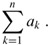
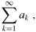
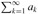
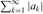
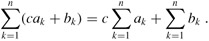
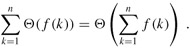
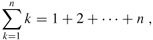
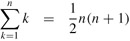
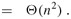

# Appendix A 

## main Summation formula

- If n = 0, the value of the summation is defined to be 0. The value of a finite series is always well defined, and its terms can be added in any order.Given a sequence a1, a2, ... of numbers, the infinite sum a1 + a2 + ··· can be written

- If the limit does not exist, the series diverges; otherwise, it converges. The terms of a convergent series cannot always be added in any order. We can, however, rearrange the terms of an absolutely convergent series, that is, a series  for which the series  also converges.

---
## Linearity

- The linearity property is also obeyed by infinite convergent series.

- The linearity property can be exploited to manipulate summations incorporating asymptotic notation. For example,

- In this equation, the Θ-notation on the left-hand side applies to the variable k, but on the right-hand side, it applies to n. Such manipulations can also be applied to infinite convergent series
---
## Arithmetic series
- The summation

- is an arithmetic series and has the value
 
## Sums of squares and cubes
 

 

## Geometric series

