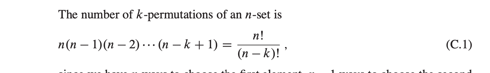
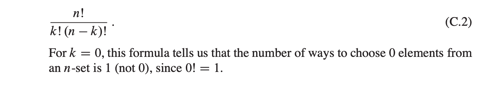
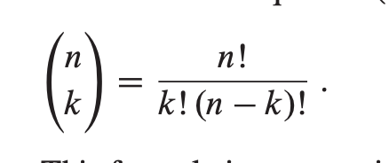
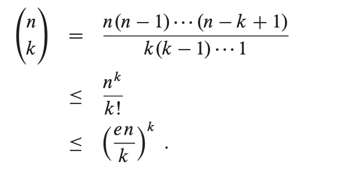
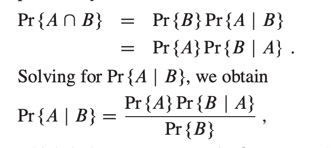
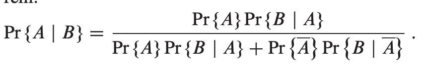

# Appendix C "Counting and Probability"
## C.1 Counting
### Rules of sum and product
- The rule of sum says that the number of ways to choose one element from one of two disjoint sets is the sum of the cardinalities of the sets |A U B| = |A| + |B|.
- The rule of product says that the number of ways to choose an ordered pair is the number of ways to choose the first element times the number of ways to choose the second element |A x B| = |A| * |B|.
### Strings
- a string simply means a finite sequence of characters
- An alphabet is a nonempty finite set
- here are 8 binary strings of length 3: 000, 001, 010, 011, 100, 101, 110, 111 In general for an n-bit string we get 2ˆ𝑛 possible strings.
### Permutations
- A permutation of a finite set S is an ordered sequence of all the elements of S, with each element appearing exactly once ,There are n! permutations of a set of n elements
- if S = {a,b,c} then S = abc, acb, bac, bca, cab, cba 
- we can choose the first element of the sequence in n ways, the second in n - 1 ways, the third in n - 2 ways, and so on.
- A k-permutation of S is an ordered sequence of k elements of S, with no element appearing more than once in the sequence
- -permutations of the set{a,b,c,d} are ab,ac,ad,ba,bc,bd,ca,cb,cd,da,db,dc 

### Combinations
- A k-combination of an n-set S is simply a k-subset of S, the 4-set{a,b,c,d} has six 2-combinations: ab,ac,ad,bc,bd,cd

### Binomial coefficients
- The binomial coefficients are the integers calculated using the formula

### Binomial bounds

## C.2 Probability
- Probability is an essential tool for the design and analysis of probabilistic and randomized algorithms.
- We define probability in terms of a sample space S, which is a set whose elements are called elementary events,We define each elementary event as a possible outcome of an experiment.
- event is a subset of the sample space S

### Axioms of probability
- A probability distribution pr{}
     - Pr{A} ≥ 0 for any event A.
     - Pr{S} = 1
     - Pr{A U B} = Pr{A} + Pr{B}  
     - The null event ø has probability Pr{ø} = 0.
     - S - A (the complement of A),Pr{A} = 1 - Pr{A}

### Discrete probability distributions
- A probability distribution is discrete if it is defined over a finite or countably infinite sample space
### Continuous uniform probability distribution
- The continuous uniform probability distribution is an example of a probability distribution in which not all subsets of the sample space are considered to be events
- it is defined over a closed interval [ a,b ] where a < b.
### Conditional probability and independence

### Bayes’s theorem
- describes the probability of an event, based on prior knowledge of conditions that might be related to the event.

## C.3 Discrete random variables
- is a function from a finite or countably infinite sample space S to the real numbers
### Expected value of a random variable
- The expected value of a random variable is denoted by E[ X ].
- The expected value can be thought of as the “average” value attained by the random variable
### Variance and standard deviation
- variance is a measure of dispersion that takes into account the spread of all data points in a data set.
- It’s the measure of dispersion the most often used, along with the standard deviation, which is simply the square root of the variance. 
- The variance is mean squared difference between each data point and the centre of the distribution measured by the mean.

 